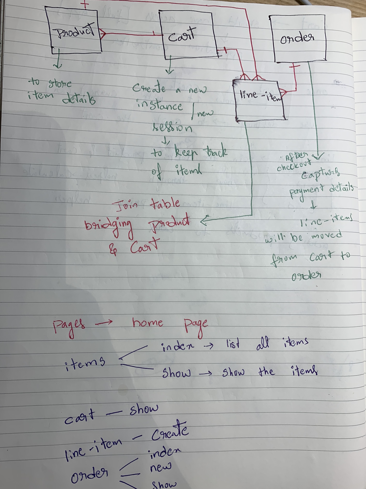

#Project 1 of the SEI course 


Things you may want to cover:

* Ruby version -ruby 2.7.4


https://user-images.githubusercontent.com/24316133/146149130-3003b91d-c9db-40db-8419-a785287765d8.mp4


* Deployment instructions

# Nomadic
- Nomadic is a concept e-commerce full-stack application built with Ruby on Rails and other technologies.
- I made this full-stack CRUD app with a concept of a shopping cart for my second project of General Assembly's Software Engineering Immersive Program. 
- The project is deployed on Heroku.

Visit here: https://projectshop1.herokuapp.com/

## About
- Nomadic is my first Ruby on Rails project. 
- It has a user model, order model, line-item model, product model, and cart model. 
- It includes a sign up/log in functionality and a shopping cart that stores items. 

## Overview and Features
Howie's workflow notes for building a simple Rails shopping cart. Summary features outlined below:

* **User is able to:**
  - View all products
  - Add/ remove products to/ from cart
  - Checkout cart by submitting order
  - Enter order details   
  - User authentication


## The Design



## Technologies Used
1. Ruby on Rails
2. PostgreSQL
3. JavaScript and jQuery
4. Bootstrap
5. CSS

## Installation Instructions
1. Clone the repo from your terminal ```git clone https://github.com/gouthamgo/project-1.git```
2. Create the database: ```rails db:create```
3. Migrate the database: ```rails db:migrate```
4. Seed the database: ```rails db:seed```
5. Run the rails server: ```rails server```
6. Connect to rails server from the browser: ```localhost:3000```

## Next Steps
1. Implement a payment function
2. Implement an administrator function to modify and update products.
3. Adding more models to improve the user interaction
4. imporve functionality and front end desgin


## Thanks to Rowena and Pat 
